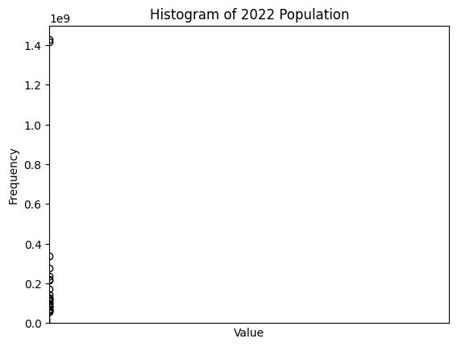

|    | describe   |   2022 Population |   Growth Rate |       Area (km²) |
|---:|:-----------|------------------:|--------------:|-----------------:|
|  0 | count      |     234           |    234        |    234           |
|  1 | null_count |       0           |      0        |      0           |
|  2 | mean       |       3.40744e+07 |      1.00958  | 581449           |
|  3 | std        |       1.36766e+08 |      0.013385 |      1.76184e+06 |
|  4 | min        |     510           |      0.912    |      1           |
|  5 | 25%        |  409984           |      1.0017   |   2586           |
|  6 | 50%        |       5.57914e+06 |      1.0079   |  83534           |
|  7 | 75%        |       2.25936e+07 |      1.0171   | 438317           |
|  8 | max        |       1.42589e+09 |      1.0691   |      1.70982e+07 |

